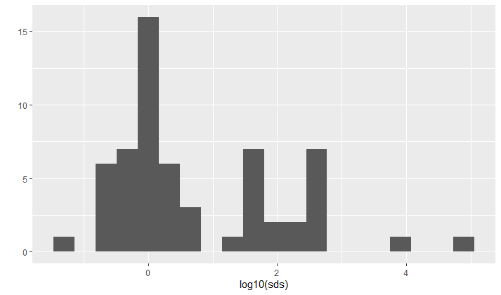
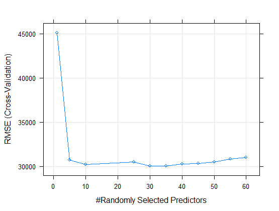
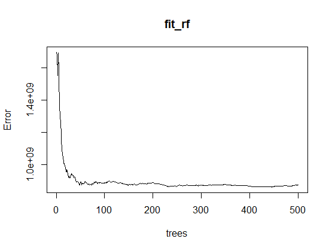

```{r setup, include=FALSE}
knitr::opts_chunk$set(echo = TRUE)
```

# Introduction

In this project, several machine learning models are built to predict house prices. The data set is downloaded from a current competition project posted on the [Kaggle site](https://www.kaggle.com/c/house-prices-advanced-regression-techniques). The data set contains house price data with 79 explanatory variables describing (almost) every aspect of residential homes in Ames, Iowa. 

The root-mean-square-error (RMSE) between the logarithm of the predicted sale prices and the logarithm of the observed sales prices is used to assess the efficiency of proposed methods. 


The dataframe obtained after reading downloaded data into `R` contains both numerical and  character columns. Some columns  contain missing values labeled by `NA`. For simplicity, all the columns containing `NA` are removed. Further,  all character columns are converted into numeric columns. 

Some columns have near-zero-variance (`nzv`). We tested our algorithms on using all columns versus only using columns that do not have near-zero-variance. 

Algorithms used in this project are K-nearest-neighbor (`knn`), linear regression (`lm`),  regularized lasso and elastic-net linear model (`glmnet`), and random forest (`rf`). We reported the RMSE for each algorithm coupled with using all columns or only using columns that do not have near-zero-variance. 

Finally, based on the experiments, we select the `glmnet` method and the `rf` method  to form an ensemble method together with removing the `nzv` columns. The formed ensemble method outperforms all surveyed methods and has achieved a relatively good prediction result. 

The remainder of the report includes sections of Methods and Analysis, Results and Conclusion. In the section of Methods and Analysis, we first  describe the data acquisition, cleaning, exploration and visualization; We then describe in detail our methods to build up each model and how to train a hyper-parameter. In the section of Results, we summarize the prediction results with different methods.  Conclusion remarks are given in the section of Conclusion with some future work outlined. 


# Methods and Analysis

This section will discuss in detail the methods used ranging from data acquisition, cleaning, wrangling, exploration, visualization to machine learning methods   to build up a house price model. Training model hyper-parameters  is also described.  


## Data acquisition, cleaning, exploration and visualization

### Data acquisition

We have uploaded the originally zipped data file downloaded from the Kaggle site to the author's [Github site](https://github.com/ywanglab/House-Prices-Advanced)  so that the data file can be downloaded from the supplied R script when it is executed. The following code was used to download the data: 
```{r eval=FALSE, message=FALSE}
if (!exists("test.cvs") & !exists("train.csv")) {
dl <- tempfile()
download.file(
  "https://github.com/ywanglab/House-Prices-Advanced/raw/main/
  house-prices-advanced-regression-techniques.zip", dl)
unzip(dl)
rm(dl)
}
```
We then read the data sets from the two unzipped files: "train.csv" and "test.csv". 
```{r eval=FALSE}
train_set_0 <- read_csv("train.csv")
test_set_0 <- read_csv("test.csv")
```
### Data description

Table 1 Describes the dimensions of the two data sets `train_set_0` and `test_set_0`. 

------------------------------------------------------------------------
                            `train_set_0`                   `test_set_0`  
-----------------  ----------------------         ----------------------
Number of rows          1460                           1459 

Number of columns         81                             80      

------------------------------------------------------------------------                    
Table: `train_set_0`  and `test_set_0` 

Note that  `test_set_0` has one fewer column: it does not have the target variable `SalePrice` 
column that is  the last column of  `train_set_0`. This is because  the data in `test.cvs` is supposed to be used for making predictions to participate in the Kaggle competition  and the target values of `SalePrice` is not provided in the data file `test.cvs`. Therefore, after this point, in order to be able to validate our proposed methods, we will only use  the set `train_set_0` in this project. 


The following code   

```{r eval=FALSE}
names(train_set_0)
```
reveals the columns in the set `train_set_0` as in Table 2. 

----  ---------------  --------------  -------------   --------------- 
[1]   "Id"             "MSSubClass"    "MSZoning"      "LotFrontage"  

 [5]  "LotArea"        "Street"        "Alley"         "LotShape"    
 
 [9]  "LandContour"    "Utilities"     "LotConfig"     "LandSlope"   
 
[13]  "Neighborhood"   "Condition1"    "Condition2"    "BldgType"    

[17]  "HouseStyle"     "OverallQual"   "OverallCond"   "YearBuilt"   

[21]  "YearRemodAdd"   "RoofStyle"     "RoofMatl"      "Exterior1st" 

[25]  "Exterior2nd"    "MasVnrType"    "MasVnrArea"    "ExterQual"   

[29]  "ExterCond"      "Foundation"    "BsmtQual"      "BsmtCond"    

[33]  "BsmtExposure"   "BsmtFinType1"  "BsmtFinSF1"    "BsmtFinType2" 

[37]  "BsmtFinSF2"     "BsmtUnfSF"     "TotalBsmtSF"   "Heating"     

[41]  "HeatingQC"      "CentralAir"    "Electrical"    "1stFlrSF"    

[45]  "2ndFlrSF"       "LowQualFinSF"  "GrLivArea"     "BsmtFullBath" 

[49]  "BsmtHalfBath"   "FullBath"      "HalfBath"      "BedroomAbvGr" 

[53]  "KitchenAbvGr"   "KitchenQual"   "TotRmsAbvGrd"  "Functional"   

[57]  "Fireplaces"     "FireplaceQu"   "GarageType"    "GarageYrBlt"  

[61]  "GarageFinish"   "GarageCars"    "GarageArea"    "GarageQual"   

[65]  "GarageCond"     "PavedDrive"    "WoodDeckSF"    "OpenPorchSF"  

[69]  "EnclosedPorch"  "3SsnPorch"     "ScreenPorch"   "PoolArea"    

[73]  "PoolQC"         "Fence"         "MiscFeature"   "MiscVal"  

[77]  "MoSold"         "YrSold"        "SaleType"      "SaleCondition" 

[81]  "SalePrice"
----  ---------------  --------------  -------------   --------------- 

Table: column names in `train_set_0`

A detailed descripton of the columns can be found by clicking [here](https://github.com/ywanglab/House-Prices-Advanced/blob/main/data_description.txt).

There are both numerical columns and character columns. The first column `Id` simply identifies a data record and it's not a feature. It will be removed before computation. 
The last column `SalePrice` is the target variable. 

 
### Data cleaning and wrangling


Next we need to perform some data cleaning tasks: mainly to convert character variables to numeric and to remove columns with missing values. 

#### Removing columns with missing values

Let's examine if there are missing values by running the code
```{r eval=FALSE}
table(is.na(train_set_0))
```
Yes, the above code reports that there are  missing values as indicated in Table 3.

------- -------
 FALSE    TRUE 
111295   6965
-------  ------

Table: number of missing values (6965) in `train_set_0`


Table 4 lists all 19  columns that contains NA: 

---- -------------- -------------- -------------- ---------------
[1]  "LotFrontage"  "Alley"        "MasVnrType"   "MasVnrArea"  
 [5] "BsmtQual"     "BsmtCond"     "BsmtExposure" "BsmtFinType1"
 [9] "BsmtFinType2" "Electrical"   "FireplaceQu"  "GarageType"  
[13] "GarageYrBlt"  "GarageFinish" "GarageQual"   "GarageCond"  
[17] "PoolQC"       "Fence"        "MiscFeature"  
---- -------------- -------------- -------------- ---------------

Table: columns containg missing values

For simplicity, we  removed all columns with missing values in building our machine leaning models. In the future, we can explore more closely of those removed features and see if using those columns can improve the accuracy of a model. We remark that a common method is to use median value to replace the missing values. 

#### Convert character columns to numeric 

We will also need to convert all character columns to numeric to be able to conduct computation. 
Table 5 lists all character columns:  

---- -------------   -------------   --------------- ---------------
[1]  "MSZoning"      "Street"        "LotShape"      "LandContour"  
 [5] "Utilities"     "LotConfig"     "LandSlope"     "Neighborhood" 
 [9] "Condition1"    "Condition2"    "BldgType"      "HouseStyle"   
[13] "RoofStyle"     "RoofMatl"      "Exterior1st"   "Exterior2nd"  
[17] "ExterQual"     "ExterCond"     "Foundation"    "Heating"      
[21] "HeatingQC"     "CentralAir"    "KitchenQual"   "Functional"   
[25] "PavedDrive"    "SaleType"      "SaleCondition"
---- -------------   -------------   --------------- ---------------
Table: names of character columns

These columns shall be converted to class of `factor` and then class of `numeric` by  using  the following code. For example, for the column `MSZoning`:
```{r eval=FALSE}
data <- train  # train is the training set after removing all columns containing NA. 
# MSZoning: convert from char to numeric
data <- data %>% mutate(MSZoning=as.numeric(factor(MSZoning)))
#C(all)   FV   RH   RL  RM
# 1       2    3     4   5
```

### Obtaining a training set and a test set
Now we are ready to create a `train_set` and a `test_set` from the original `train_set_0`: 
```{r eval=FALSE}
train0 <- data
set.seed(1, sample.kind = "Rounding") 
test_index <-
  createDataPartition(
    y = train0$SalePrice,
    times = 1,
    p = 0.2,
    list = FALSE
  )

train_set <- train0[-test_index, ]
test_set <- train0[test_index, ]

# remove tehe first column `Id`
train_set <- train_set[,-1]
test_set <- test_set[,-1]

```
We have set aside 20\% of the entire `train_set_0` for testing. The first column `Id` was removed, as it is not  a feature varaible of a house. 
Now let's look at the size of `train_set` and  `test_set`. 

------------------------------------------------------------------------
                              `train_set`                   `test_set`  
-----------------  ----------------------         ----------------------
Number of rows          1166                           294 

Number of columns         61                            61      

------------------------------------------------------------------------                    
Table: `train_set`  and `test_set` 

The `test_set` will be hold out until we have built a model and will only be used to test the accuracy of our models. 


### Explore the data set

A glimpse of the original data set reveals that quite a few columns have near-zero-variance. For example, for the column `Utilities`, using the code 
```{r eval=FALSE}
table(train_set_0$Utilities)
```
returns 
```{r eval=FALSE}
AllPub NoSeWa 
  1459      1 
```
Among all the houses in the original `train_set_0`, there is only one house using a different type of utilities. Even worse, in the `train_set`, using the code 
```{r eval=FALSE}
table(train_set$Utilities)
```
returns 
```{r eval=FALSE}
1
1166
```
which indicates that all the $1166$ houses in the `test_set` use the same type of utilities identified with the value `1`. The value  `1` above `1166` is the numerical value for the `Utilities` type `AllPub` after the `Utilities` column is converted to `numeric`.   Thus this column `Utilities` has a  zero variance in `train_set`. *A zero or near-zero-variance (`nzv`) column will lead to unreliable model, in general*.  


We can explore the entire `train_set` by plotting the logarithm (`log`) of  the column standard deviations using the following code: 
```{r eval=FALSE}
library(matrixStats)
sds <- colSds(data.matrix(train_set))
qplot(log10(sds), bins = 20)
```
 The logarithm was applied to suite for the large variations of standard deviation values across columns. 

 

We can see from the histogram that there are quite many columns with large negative `log10(sds)` values, i.e., with near-zero-variance.  All those columns can be identified using the code 
```{r eval=FALSE}
nzv <- nearZeroVar(train_set)
# number of nzv columns 
length(nzv)
colNames <- names(train_set)
colNames[nzv]
```
These are  $15$ `nzv` columns identified: 

---- -------------   --------------  ---------------
 [1] "Street"        "LandContour"   "Utilities"    
 [4] "LandSlope"     "Condition2"    "RoofMatl"     
 [7] "Heating"       "LowQualFinSF"  "KitchenAbvGr" 
[10] "Functional"    "EnclosedPorch" "3SsnPorch"    
[13] "ScreenPorch"   "PoolArea"      "MiscVal" 
---- -------------   --------------  ---------------
Table: Near-zero-variance (nzv) columns in `train_set`


We will later explore the effects of those near-zero-variance columns by comparing the prediction `RMSE` values of models with and without those columns. 

## Model-building methods

We will explore the following machine learning algorithms to build an efficient model:

* K-Nearest Neighbor (`knn`)
* Linear Regression Model (`lm`)
* Regularized Lasso and Elastic-Net Linear Model (`glmnet`)
* Random Forest (`rf`)

For each method, we will compare the `RMSE` results between with and without removing the near-zero-variance columns. We will also train the hyper-parameters for KNN and  the Random Forest algorithms. The hyper-parameters of `glmnet` will be automatically chosen by the algorithm. 

At the end, we built  

* an ensemble model based on a combination of  `glmnet` and `rf` and obtained a better model that outperforms any single method surveyed. 

The root-mean-squre-error (RMSE) between the logarithm of the predicted `SalePrice` and the logarithm of the observed `SalePrice` is used to assess the efficiency of a proposed method. Specifically, 
$$
\text{RMSE}=\sqrt{\frac{1}{N} \left(\log(\text{predicted SalePrice}) -\log (\text{true SalePrice})\right)^2 },
$$
where $N$ is the total number of observations. The smaller RMSE is, the more powerful a prediction model is. 

Taking logarithm indicates that 
$$
\text{preidcted SalePrice} = \pm(\text{e}^{\text{RMSE}}-1)(\text{true SalePrice})\approx \pm (\text{RMSE})(\text{true SalePrice})
$$
when the value of RMSE is small (close to zero) by the Taylor Theorem. For example, a RMSE of 0.13 indicates that the predicted SalePrices are on average within approximately 13% of the true SalePrices. 

### K-Nearest-Neighbor (`knn`)
We first train a `knn` model with all available columns. Cross-validation is used to search for a  best $k$-value in the grid `seq(1,100,5)`. The following codes are used: 
```{r eval=FALSE}
control <- trainControl(method = "cv", number = 5, p = .9)
train_knn <- train(train_x, train_y,  method = "knn", 
                       tuneGrid = data.frame(k = seq(1, 100, 5)),
                   trControl=control)
```
The best $k$-value is found to be 
$$
k_\text{best}=6. 
$$
We then apply the trained model with $k_\text{best}=6$ to the hold-out  `test_set`,  and obtained a RMSE of  0.2184541. 

Next we  remove the near-zero-variance columns (variables), and then repeat the the same KNN training and predicting algorithm. Cross-validation returns the same best value of $k$, i.e., 
$k_\text{best}=6$. Then the fitted knn model returns a RMSE value of 0.2214171. For some reason, the RMSE increases slightly after removing the `nzv` columns, which is not expected. We will explore why in the future work. 

### Linear Regression (`lm`)
We now turn to use a linear regression model (`lm`) to fit the training data. No hyer-parameters need to be tuned. Again two cases are considered: 

* using all columns
* removing `nzv` columns

The resulted `RMSEs` are: 

* with all columns: `RMSE` = 0.1747860
* with nzv columns removed: `RMSE` = 0.1683365

As expected, after removing the `nzv` columns, the `RMSE` is reduced, that is, a better prediction is achieved. 


### Regularized Lasso and Elastic-Net Linear Regression (`glmnet`)

We next perform an elastic-net regularized Linear regression using the method `glmnet`. The following code is used: 
```{r eval=FALSE}
train_lmr <- train(train_x, train_y, method ="glmnet")
predict_lmr <-predict(train_lmr,test_x)
```
The hyper-parameters are chosen by the algorithm. Again we compare the results for two scenarios: 

* with all columns: `RMSE`= 0.1572250

* with  `nzv` columns removed: `RMSE`= 0.1574862

The RMSE  slightly increases after removing the `nzv` columns, a little surprising. 

###  Random Forest (`rf`)

We train a random forest model for both   scenarios: 1) using all columns and 2) removing the `nzv` columns. For each scenario, we will train two hyper parameters: 1) `mtry`: the number of predictors in a tree 2) `nodesize`: the minimum number of observations in a node. The larger `nodesize` is, the smoother a model is, hence may lead to under-fitting. We then use the best values of `mtry` and `nodesize` to train a final random forest model. 

#### train a best number of predictors (`mtry`)
Cross-validation is used to select a best number of predictors (`mtry`) to be used. The following code is used: 

```{r eval=FALSE}
control <- trainControl(method="cv", number = 5)
grid <- data.frame(mtry = c(1,5, 10, 25, 30,35,40,45, 50,55,  ncol(train_set)-1))

```



The best `mtry`  can be seen from the above plot 
$$
\text{mtry}_{\text{best}}=30.
$$

With the best `mtry=30`, we fit a `rf` model, and obtained  

* with all columns and $\text{mtry}_{\text{best}}=30$: `RMSE` =0.1418731. 

The following  plot describes the model errors versus the number of trees. 



#### train a best number of `nodesize`

Next we train a `rf` model considering to select a best `nodesize` with $\text{mtry}_{\text{best}}=30$. 
The searched grid is 
```{r eval=FALSE}
nodesize <- seq(1, ncol(train_x), 10)
```
The best `nodesize` can be  found from the plot below 


to be 
$$
\text{nodesize}_{\text{best}}= 21
$$

Subsequently, we  train a `rf` model with the best `mtry=30` and the best `nodesize=21` and obtained 

* with all columns, and $\text{mtry}_{\text{best}}=30$, $\text{nodesize}_{\text{best}}= 21$:  `RMSE` = 0.1455325.
The `RMSE` was slightly increased when using $\text{nodesize}_{\text{best}}= 21$. 


We then repeat the above procedures to train a `rf` model with the `nzv` columns removed. We obtained the following results: 

* with `nzv` columns removed and $\text{mtry}_{\text{best}}=25$: RMSE= 0.1400061
* with `nzv` columns removed, and $\text{mtry}_{\text{best}}=25$, $\text{nodesize}_{\text{best}}= 21$: RMSE= 0.1453213

The RMSE has been slightly improved after removing `nzv` columns, as expected. 


### An Ensemble Method

Finally based on our previous attempts, we formed an ensemble model using 

* `glmnet` method with all  `nzv` columns removed
* `rf` method with $\text{mtry}_{\text{best}}=25$.

We obtained our best model with `RMSE` =0.1369046 that outperforms any single method we explored. 


# Results

All the calculations are done on a Dell PC with Intel Core i7-7700 CPU \@ 3.60GHz with 16G RAM. Most computing time is spent in tuning the best `nodesize` for a `rf` method. Our recorded time for the entire code is around 18.5 minutes. 

We summarize the RMSE results for the various models we attempted in Table 8: 

|Method                                         |      RMSE|
|:----------------------------------------------|---------:|
|knn only                                       | 0.2184541|
|knn + nzv removed                              | 0.2214171|
|lm only                                        | 0.1747860|
|lm + nzv removed                               | 0.1683365|
|glmnet                                         | 0.1572250|
|**glmnet + nzv removed**                       | 0.1574862|
|rf + best mtry                                 | 0.1418731|
|rf + best mtry + best nodesize                 | 0.1455325|
|**rf + best mtry + nzv removed**               | 0.1400061|
|rf + nzv + best mtry + best nodesize           | 0.1454213|
|**ensemble: glmnet + rf + best mtry + nzv removed** | 0.1369046|

Table: `RMSE` results of various models

The best model is the ensemble model built using a `glmnet` model and a `rf` model. 

Finally, we used the  code 
```{r eval=FALSE}
# Importance of features
varImp(fit_rf_nzv) %>% arrange(desc(Overall)) %>% top_n(10)
```
to reveal the top 10 most important features selected by the random forest algorithm with the best `mtry=25` when all `nzv` columns are removed. The list confirms that the commmons sense of important factors considered when people are finding a house. 

----------- --------
             Overall
             
GrLivArea   33.95785
OverallQual 32.10978
TotalBsmtSF 18.81201
BsmtFinSF1  17.12837
1stFlrSF    15.66289
2ndFlrSF    15.57752
Fireplaces  14.42383
GarageCars  14.33497
GarageArea  14.23009
MSZoning    13.51258
----------- --------

Table: Top 10 important variables 

# Conclusion


In this project, we explored K-Nearest Neighbor (`knn`), linear regression (`lm`), regularized lasso and elastic-net regression (`glmnet`), random forest (`rf`) machine learning methods to predict house prices using a data set from Kaggle website. After removing columns containing missing values, for each method, we compared the scenario using all columns to the scenario of removing all near-zero-variance columns. The following conclusions can be drawn: 

* KNN performs the worst among the methods surveyed;
* Regularized elastic-net regression (`glmnet`) outperforms linear regression (`lm`);
* Random forest (`rf`) method performs the best among all methods surveyed; 
* When `nzv` columns are removed, the performance of  `lm` and `rf` is improved; but the performance of `knn`, `glmnet` is slightly worsened;
* optimizing `nodesize` for `rf` does not improve the performance of `rf`;
* An ensemble model using the `glmne`t method and the `rf` method optimized with best `mtry` with `nzv` columns removed outperforms both `glmnet` method and `rf` method. 

Future work may include explore more closely about the column features, such as 1) replacing missing values by the median values for a variable; 2) investing more closely of the `nzv` columns to retain some of those columns; 3) explore other methods such as gradient boosting and bagging methods. 


